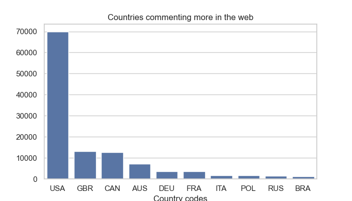
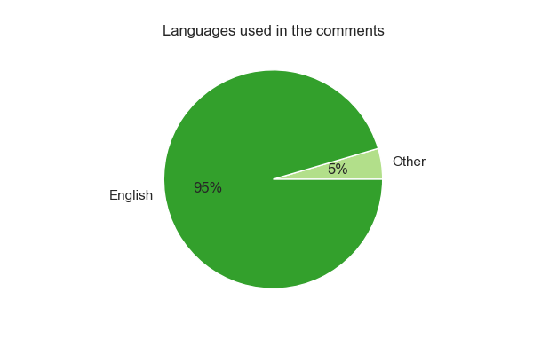
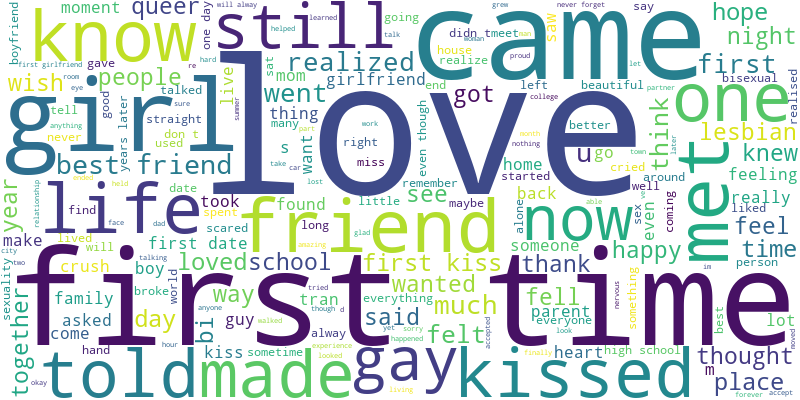
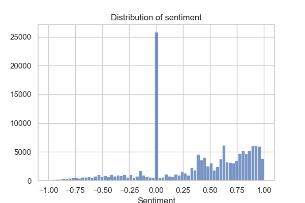
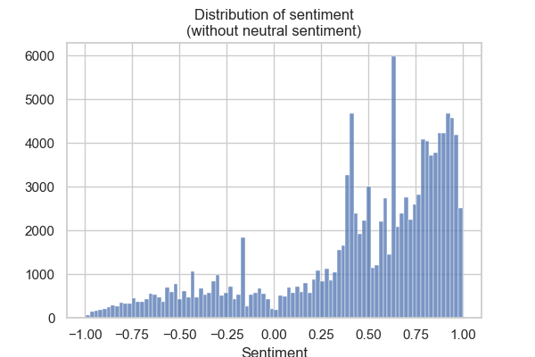
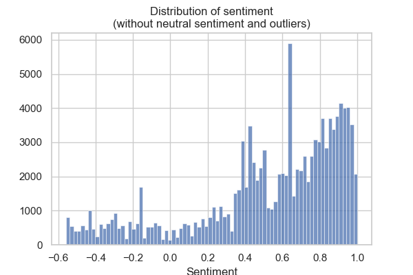

# Final Project
[GitHub](https://github.com/MartaGDC)

[Streamlit](https://ironhacking.streamlit.app/)

## Introduction
In 2017 Lucas LaRochelle created Queering The Map as part of a class project. This is a "community generated counter-mapping platform for digitally archiving LGBTQ2IA+ experience in relation to physical space", whose purpose is provide a safe space for queer people around the globe to share experiences anonimously, and link them to a physical space.

The information of the page arises this question:

**
How does race, gender, sexuality, citizenship, ability, and class affect the ways in which we relate to, move through, and create space?
**

The purpose of this project is to give some insights in the process of answering this question, respecting the anonimity of the community involved, thorugh the analysis of the discourse of the shared experiences and it's relationship with the physical space defined by each country.

### Research questions:
- How is the web used?
    - Where is it mostly used?
    - How are the communities we can find within a country?
- How is the sentiment of the comments found in the web?
    - How is it by country?
- How many characters do people use and what's the emotionality of the comments found in the web?
    - How are they by country?
- How do they relate to the countries' characteristics?
- What are the country variables that affect the most to the metrics of the comments found in the web?

## Methodology
### Libraries:
- folium: Map
- folium.plugins: HeatMap
- geopandas
- json
- langid
- matplotlib.pyplot
- msgpack
- nltk
- nltk.corpus: stopwords
- nltk.sentiment.vader: SentimentIntensityAnalyzer
- numpy
- pandas
- pymongo: MongoClient
- requests
- scipy.stats: f_oneway
- seaborn
- sklearn: preprocessing
- sklearn.cluster: KMeans
- sklearn.linear_model: LinearRegression
- spacy
- statsmodels.formula.api
- wordcloud: WordCloud

#### Streamlit:
- base64
- matplotlib.pyplot
- nltk
- nltk.corpus: stopwords
- nltk.sentiment.vader: SentimentIntensityAnalyzer
- numpy
- pandas
- PIL: Image
- random
- streamlit
- streamlit.components.v1
- wordcloud: WordCloud

### Process:
- Description:
    - Web
    - Discourse
- Analysis of the relationship between countries' characteristics and sentiment and emotionality.
- [Strealit page](https://ironhacking.streamlit.app/) creation.

### Analysis
- **H0**: The characteristics of the context in each country don't interfere with the nature of the discurse shared on the web.

- **H1**: These characteristics affect the discurse shared on the web.

After a quick bibliographic research about country determinants for stigma and discrimination related to sexual orientation and gender identity[1], 18 different variables were collected[2]-[3]:
- Region:
    - East Asia & Pacific
    - Europe & Central Asia
    - Latin America & Caribbean
    - Middle East & North Africa
    - North America
    - South Asia
    - Sub-Saharan Africa
- Political context:
    - Political stability and absence of violence/terrorism:
        - Measured as Percentile Rank
    - Rule of Law:
        - Measured as Percentile Rank
    - Proportion of seats held by women in national parliaments (%)
    - Voice and Accountability:
        - Measured as Percentile Rank
- Economic context:
    - Income group:
        - High income
        - Upper middle income
        - Lower middle income
        - Low income
    - GDP:
        - Measure as GDP (current US$)
- Education context:
    - Children out of school (% of primary school age)
    - Current education expenditure, total (% of total expenditure in public institutions)
    - Literacy rate, adult total (% of people ages 15 and above)
- Health context:
    - Antiretroviral therapy coverage (% of people living with HIV)
    - Current health expenditure (% of GDP)
    - Universal Health Care (UHC) service coverage index
- LGBT+ context:
    - LGBT+ rights index
    - Same-sex sexual acts illegal
    - Censorship of LGBT issues
    - Gender marker change
    - Hate crimes based on sexual orientation or gender identity are an aggravating circumstance

The values considered were the mean between 2017 and present time, considering that the webpage started in 2017 and there is no data available about the dates of the comments. In case of missing values, these were imputed calculating the mean value for each variable missing grouping by region and income group, as these were the ones that seem more associated with the continuous variables (no statistical test was done to check this hypothesis).

The nature of the discurse was defined by the sentiment determined with the nltk Python library, and the emotionality.

Emotionality is a metric created to face the issue of false neutral sentiment. It takes into consideration the sentiment absolute value but also the character length in the comments. It represents the emotional intensity of the comments, without reflecting if they are positive or negative.

$$ Standard\ length = {Number\ of\ characters \over Maximum\ number\ of\ characters} $$

$$ Emotionality = Standard\ length * (|Sentiment| + 1) $$

The relationship of each of the variables and the discourse was evaluated on their own, and as a whole, using linear regression.

[1]: <https://doi.org/10.1093/eurpub/cky023> "E. Lamontagne, M. d'Elbée, M. W. Ross, A. Carroll, A. du Plessis, L. Loures. A socioecological measurement of homophobia for all countries and its public health impact. European Journal of Public Health. 28.5 (2018): 967-972."
[2]: <https://data.worldbank.org/> "World Bank"
[3]: <https://ourworldindata.org/lgbt-rights> "LGBT+ Rights"

## Description of the web use

### Country use
These are the countries where we find more comments in the web:

The USA contains 46.81% of all the comments.

| Country | Count | Percentage |
|---------|------:|-----------:|
| USA     | 69976 | 46.81      | 
| GBR     | 13175 | 8.81       |
| CAN     | 12690 | 8.49       |
| AUS     | 7163  | 4.79       |
| DEU     | 3697  | 2.47       |
| FRA     | 3502  | 2.34       |
| ITA     | 1706  | 1.14       |
| POL     | 1603  | 1.07       |
| RUS     | 1339  | 0.90       |
| BRA     | 1293  | 0.86       |

### Language use
The language of the comments was detected using the library langid from Python.

As more than 95% of the comments were in english according to this library, and there were issues translating, those in a different language weren't translated.

| Language | Count  | Percentage |
|----------|-------:|-----------:|
| en       | 142688 | 95.45      |
| fr       | 1696   | 1.13       |
| es       | 1303   | 0.87       |
| de       | 427    | 0.29       |
| pt       | 317    | 0.21       |
| it       | 295    | 0.20       |
| nl       | 274    | 0.18       |
| et       | 272    | 0.18       |
| da       | 217    | 0.15       |
| ru       | 202    | 0.14       |

## Description of the discourse

### Word count
It was done only considering those comment in english. Using the library nltk.corpus, and the stop words present by default in it, the most repeated english words in the world were "first", "love" and "time".

| Top words | Count  |
|-----------|-------:|
| first     | 104962 |
| love      | 56184  |
| time      | 44910  |
| came      | 31703  |
| never     | 28278  |
| still     | 28254  |
| like      | 26964  |
| here.     | 25196  |
| girl      | 25024  |
| one       | 24172  |

To create the wordclouds, no stop words were considered as the visual results were more evident including them in the graphs.

In the [streamlit](https://ironhacking.streamlit.app/) page, it is possible to explore the wordclouds for every country.

### Sentiment
As you can ssee in the graph there are a lot of neutral values (16.84%) for the sentiment using the nltk library in Python.

If we ignore that 16.84% of neutral values, this is the distribution of sentiment in the discourse shown in the web. It is clear that most of the comments show a positive sentiment.

There are negative ouliers below the sentiment value of -0.5576. This would be distriution without neutral and outlier values.

### Length of the characters
This is the distribution of the number of characters per comnent in the web. There are some few comments with a lot of characters:

There are 5.64% of outliers. This would be the distribution without condidering the outliers with more than 413 characters.

### Emotionality
The distribution of emotionality is similar to the distribution of length but more homogenous, showing 6.31% of outliers

This would be the distribution without the outliers with an emotionality value higer than 0.1235.

## Analysis of the discourse and countries' characteristics

### Relationship between every characteristic of the countries and the discourse
The folowing table shows the coefficients for those variables that show a statistically significant relationship with the discourse sentiment or emotionality, and the p-values for all the variables included.

|                                | *Sentiment*                     |              | | *Emotionality*                  |             |
---------------------------------|:-------------------------------:|-------------:|-|:-------------------------------:|------------:
**Quantitative variables**       | **Coefficients if significant** | **p-value**  | | **Coefficients if significant** | **p-value** 
Political stability              | -                               | 0.534625     | | -0.000025                       | 0.001841
Rule of Law                      | -0.000269                       | 0.000056     | | -                               | 0.249311
Proportion of female seats       | -0.000395                       | 0.000973     | | 0.000126                        | 1.520583e-18
Voice and Accountability         | -0.000182                       | 0.002112     | | -                               | 0.605112
GDP                              | -1.253206e-14                   | 0.000007     | | 1.319243e-15                    | 0.000083
Children out of school           | 0.001325                        | 0.000294     | | -                               | 0.069918
% of education expenditure       | -0.004844                       | 2.319145e-07 | | 0.000654                        | 6.108558e-09
Adult literacy rate              | -0.000491                       | 0.001606875  | | -0.000047                       | 0.01114636
Antiretroviral therapy coverage  | -0.000426                       | 0.000211     | | -                               | 0.326746
% of health expenditure          | -0.004398                       | 4.661136e-09 | | 0.000276                        | 0.002159
UHC coverage index               | -0.000589                       | 0.000021     | | -                               | 0.6962483
LGBT+ rights index               | -0.001712                       | 0.000009     | | -                               | 0.486615
Legality of same-sex sexual acts | 0.042458                        | 0.000094     | | 0.002900                        | 0.026142
Hate crimes protection           | -                               | 0.575047     | | -                               | 0.134443
|
**Categorical variables**        | **Coefficients if significant** | **p-value**  | | **Coefficients if significant** | **p-value**
**Region**, East Asia & Pacific (ref)
Europe & Central Asia            | -                               | 0.053812     | | -                               | 0.877080
Latin America & Caribbean        | -                               | 0.102969     | | -                               | 0.791358
Middle East & North Africa       | -                               | 0.578289     | | 0.004308                        | 0.000247
North America                    | -                               | 0.769441     | | -0.001541                       | 0.004599
South Asia                       | -                               | 0.723594     | | -                               | 0.168310
Sub-Saharan Africa               | -                               | 0.411084     | | -                               | 0.063408
**Income**, High income (ref)
Upper middle income              | 0.014205                        | 0.007249     | | 0.002037                        | 0.000967
Lower middle income              | -                               | 0.574642     | | 0.003837                        | 0.000035
Low income                       | 0.074843                        | 0.024217     | | 0.008464                        | 0.028941
**Censorship**, Imprisonment as punishment (ref)
No censorship                    | -0.029614                       | 0.02316450   | | -                               | 0.05776440
Varies by region                 | -                               | 0.05982512   | | -0.003578                       | 0.01821738
Ambiguous                        | -                               | 0.1345074    | | -                               | 0.07393498
Other punishment                 | -                               | 0.4718123    | | -                               | 0.4946909
Fine as punishment               | -                               | 0.7742703    | | -                               | 0.8349811
State-enforced                   | -                               | 0.6813948    | | -                               | 0..708714
**Gender marker change**, Legal, surgery not required (ref)
Legal, but requires surgery      | -                               | 0.106977     | |  0.002478                       | 0.000528
Varies by region                 | -                               | 0.939524     | | -                               | 0.160484
Ambiguous                        | 0.020352                        | 0.022415     | | -                               | 0.133209
Illegal                          | -                               | 0.229530     | | 0.002533                        | 0.012426

### Relationship between all the characteristics of the countries and the discourse
The folowing table shows the coefficients for those variables that show a statistically significant relationship with the discourse sentiment or emotionality when including all the variables in the model, and their p-values.

|                                | *Sentiment*                     |              | | *Emotionality*                  |             |
---------------------------------|:-------------------------------:|-------------:|-|:-------------------------------:|------------:
**Variables**                    | **Coefficients if significant** | **p-value**  | | **Coefficients if significant** | **p-value**
Political stability              | 0.0005298575                    | 0.04707291   | | 0.00006340095                   | 0.04612302
Rule of Law                      | -                               | 0.4667247    | | -                               | 0.2486797
Proportion of female seats       | -                               | 0.4565885    | | 0.0001015801                    | 0.01061505
Voice and Accountability         | -                               | 0.7111574    | | -                               | 0.2153887
GDP                              | -                               | 0.2471276    | | 1.510002e-15                    | 0.002967066
Children out of school           | -                               | 0.3371182    | | -                               | 0.2652239
% of education expenditure       | -                               | 0.1730333    | | -                               | 0.4211090
Adult literacy rate              | -                               | 0.6207066    | | -                               | 0.6681972
Antiretroviral therapy coverage  | -0.0005085612                    | 0.01743667  | | -6.549984e-05                   | 0.01016903
% of health expenditure          | -                               | 0.4085597    | | -5.020974e-04                   | 0.02951934	
UHC coverage index               | -0.001239511                    | 0.01076728   | | -                               | 0.6426139
LGBT+ rights index               | -                               | 0.9783647    | | -6.603307e-04                   | 0.005983406
Legality of same-sex sexual acts | 0.08272276                      | 0.0005092681 | | -                               | 0.9414430
Hate crimes protection           | 0.03770694                      | 0.0008464976 | | 0.004804704                     | 0.0003581757
**Region**, East Asia & Pacific (ref)
Europe & Central Asia            | -                               | 0.5277016    | | -0.006949421                    | 9.481720e-07
Latin America & Caribbean        | -0.03118771                     | 0.04168091   | | 0.005412410                     | 0.003010116
Middle East & North Africa       | -                               | 0.09291297	  | | -0.008608279                    | 5.342520e-05
North America                    | -                               | 0.1117380    | | -                               | 0.4267092
South Asia                       | -                               | 0.1851692    | | -                               | 0.9386940
Sub-Saharan Africa               | 0.08012712                      | 0.0009698598 | | -                               | 0.05382876
**Income**, High income (ref)
Low income                       | -0.1366794                      | 0.0009293425 | | -0.01696737                     | 0.0005604679
Lower middle income              | -                               | 0.4612828    | | 0.005934258                     | 2.281194e-04
Upper middle income              | -                               | 0.3007255    | | -                               | 0.1544082
**Censorship**, Imprisonment as punishment (ref)
No censorship                    | 0.07907812                      | 0.0001211594 | | 0.006998407                     | 0.004299755
Varies by region                 | 0.1174667                       | 5.692929e-07 | | 0.007870485                     | 0.004911829
Ambiguous                        | -                               | 0.8170347    | | -                               | 0.1155930
Other punishment                 | -0.09580888                     | 0.03052081   | | -0.01140211                     | 0.03070329
Fine as punishment               | 0.08313862                      | 0.002126322  | | -                               | 0.2521477
State-enforced                   | 0.07800163                      | 0.0001786075 | | 0.005853332                     | 0.01825340
**Gender marker change**, Illegal (ref)
Legal, surgery not required      | -0.03134414                     | 0.01960927   | | -0.01086634                     | 1.118489e-11
Legal, but requires surgery      | -                               | 0.4242546    | | -0.007699718                    | 6.881194e-07
Varies by region                 | -0.04647625                     | 0.01220829   | | -0.01050085                     | 2.009555e-06
Ambiguous                        | -                               | 0.8860066    | | -                               | 0.3327387

A more positive sentiment was related to a higher political stability, better legal consideration of same-sex sexual acts and the recognition of hate crimes. The sentiment was significantly better in Sub-Saharan Africa in respect to East Asia & Pacific, and in countries were censorship of LGBTQ issues is done through imprisonment or there are other punishments than imprisonment or fines.

A more negative sentiment was related to a better ARV therapy and UHC coverage. It was worse in Latin America & Caribbean in respect to East Asia & Pacific, in low income countries in respect to high income conuntries, if there is censorship of LGBTQ issues done through imprisonment or other punishments than imprisonment or fines, and if gender chance is legal or varies in respect to it being illegal. Some of these results were very unexpected.

A more intense emoitionality was related to a higher political stability, higher proportion of female seats in national parliament, higher GDP and better protection against hate crimes. The emotionality was significantly more intense in Latin America & Caribbean in respect to East Asia & Pacific, in lower middle income countries in respect to high income ocuntries, and in countries with no censorship, variable or state-enforced in respect to imprisonment as punishment.

A less intense emotionality was related to a better ARV therapy coverage, higher health expenditure and higher LGBT+ rights index. It is also less intense in Europe & Central Asia and Middle East & North Africa in respect to East Asia & Pacific, in low income countries in respect to high income countries, if there is censorship punish with other than fines or imprisonment, and if gender change is legal or varies in respect to it being illegal.

## Conclusions
The most repeated words are love and first, it seems that this web is mainly used to share first experiences or coming out stories.

The nltk Python library shows limitations to provide a reliable sentiment. To evaluate intensity the length of the commments can be used, or a related metric to include the weigh of the sentiment detected.

Countries with less web use usually have “worst” country indicators, but these don't necessarily translate in a number emotionality or lower sentiment.

